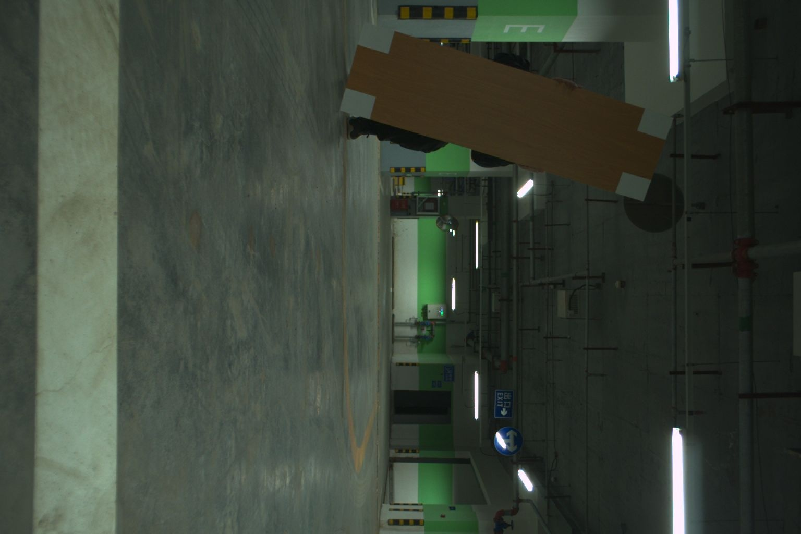

# target-based-calibration

## 1. 软件介绍

基于矩形标定板能够准确地确定激光雷达和相机之间的空间位置关系，从而实现精准的外参标定。在当前的版本中，提供了人工辅助的简单操作过程。

### 1.1 依赖安装

```bash
# Add PPA
sudo add-apt-repository ppa:borglab/gtsam-release-4.0
sudo apt update  # not necessary since Bionic
# Install:
sudo apt install libgtsam-dev libgtsam-unstable-dev
```

### 1.2 编译

```bash
mkdir build && cd build
cmake ..
make -j8
```

### 1.3 运行

```bash
# demo
bin/lidar_camera_calibrator data/data-velo-sim
```


### 2. 标定流程


## 3.标定实操

### 3.1 标定数据采集 (rosbag)

用户需要倾斜地拿着标定板进行数据采集。在进行数据采集时，用户可能需要变换若干次方位(3-5次)，确保在整个共同视野范围内都有充分的数据被捕获，为外参标定提供更为准确的结果。

### 3.2 标定数据筛选

挑选出图像清晰的数据（3-5组）用于标定，如下图所示。




### 3.3 配置文件填写

修改配置文件（config.json）中的畸变系数、相机内参和标定板大小。


### 3.4 外参标定

1.  打开标定软件，并指定标定数据根目录。


2.  图像和点云中的标定板的角点提取。

图像中的标定板角点将自动提取，如下图所示。若无marker，需要手动选择（start开始选择，finish结束）。


点云中需人工操作将标定板过滤出来，随后点击extract，即可完成角点提取。如下图所示。


### 3.5 标定结果输出及可视化验证

待完成所有数据的角点提取后，点击标定（calibrate）按钮即可完成标定，此时终端将输出标定结果，可视化界面将显示点云投影至图像以及点云着色的效果。标定结果也将写入至配置文件当中。


## 4. 致谢

感谢以下开源仓库~

https://github.com/HITSZ-NRSL/lidar_camera_calibrator

https://github.com/beltransen/velo2cam_calibration
